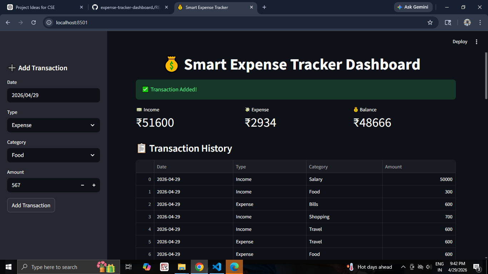
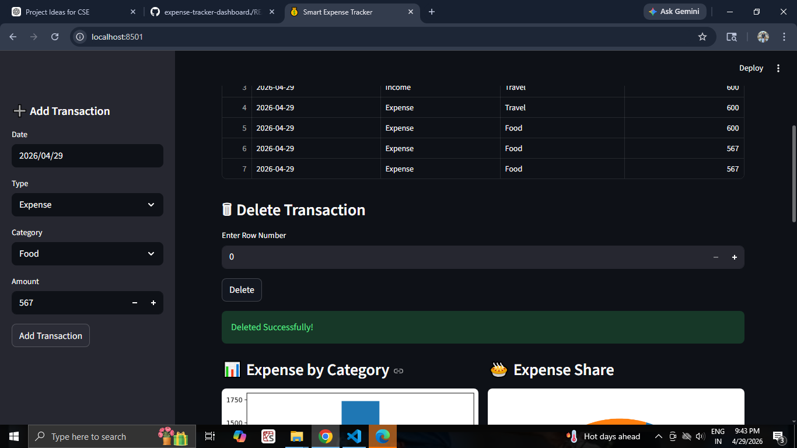
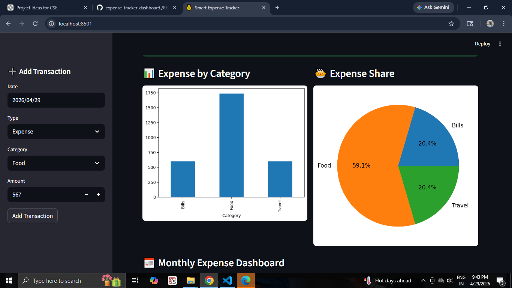
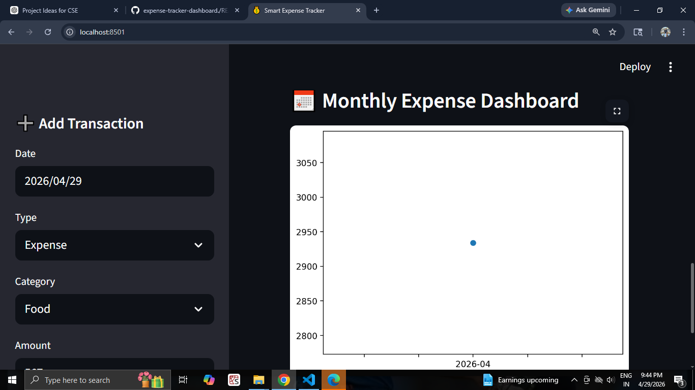

# Expense Tracker Dashboard

A web-based application to track daily expenses and visualize spending patterns.

## 📌 Features

- Add and delete expenses
- Track daily/monthly spending
- Simple and user-friendly interface
- Displays total expense summary

## 🛠 Technologies Used

- Python / JavaScript (based on your project)
- HTML
- CSS

## 📂 Project Structure

expense-tracker-dashboard/
│── index.html
│── style.css
│── script.js

## ▶️ How to Run Project

1. Open the project folder
2. Double-click index.html
3. Use the app in browser

## 🎯 Output

- Add expense
- View total spending
- Track expenses easily

## 👩‍💻 Author

Tejashwini
## 📸 Screenshots

